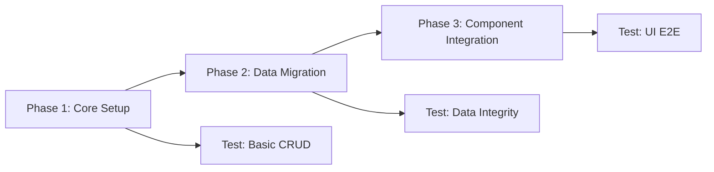

# Database Migration Plan: From Mock Data to Prisma

**Project**: MOE-TG-VX - Teacher Portal
**Branch**: `rezailmi/db-model-refactor`
**Started**: 2025-10-09
**Target Completion**: TBD

---

## 🎯 Mission

Migrate from 1000+ lines of hardcoded TypeScript mock data to a proper database using Prisma ORM, with a focus on the **3-view architecture**:
- **Attendance View** - Daily, CCA, school events, early dismissal
- **Performance View** - Academic results, CCA, physical fitness, CCE
- **Cases View** - Discipline, SEN, counselling, career guidance

---

## 📊 Technology Stack

- **ORM**: Prisma
- **Dev Database**: SQLite (file-based, zero config)
- **Prod Database**: PostgreSQL (Vercel/Supabase)
- **Testing**: Playwright (via MCP)
- **Migration Strategy**: Incremental, non-breaking

---

## 🗺️ Three-Phase Approach



---

## 📋 Phase 1: Core Setup & Schema (Est: 1-2 hours)

### 1.1 Install Dependencies
- [ ] Install Prisma packages
  ```bash
  npm install prisma @prisma/client
  npm install -D prisma
  ```
- [ ] Initialize Prisma with SQLite
  ```bash
  npx prisma init --datasource-provider sqlite
  ```

### 1.2 Create Prisma Schema
- [ ] Create `prisma/schema.prisma` with core entities:
  - [ ] Teacher model
  - [ ] Class model
  - [ ] Student model
  - [ ] ClassEnrollment junction table
  - [ ] ClassSchedule model
  - [ ] All enums (UserRole, StudentStatus, ConductGrade, etc.)

**Files to create:**
```
prisma/
  ├── schema.prisma           (~700 lines - complete schema)
  └── seed.ts                 (skeleton for now)
```

### 1.3 Create Prisma Client Singleton
- [ ] Create `src/lib/prisma.ts` (Prisma client wrapper)
- [ ] Add to `.gitignore`: `prisma/*.db`, `prisma/*.db-journal`

**File to create:**
```typescript
// src/lib/prisma.ts (~15 lines)
import { PrismaClient } from '@prisma/client'

const globalForPrisma = globalThis as unknown as {
  prisma: PrismaClient | undefined
}

export const prisma = globalForPrisma.prisma ?? new PrismaClient()

if (process.env.NODE_ENV !== 'production') globalForPrisma.prisma = prisma
```

### 1.4 Initial Migration
- [ ] Run first migration
  ```bash
  npx prisma migrate dev --name init
  ```
- [ ] Generate Prisma Client
  ```bash
  npx prisma generate
  ```
- [ ] Verify database created: `prisma/dev.db` exists

### 1.5 Phase 1 Testing

#### Test 1.1: Database Connection
```typescript
// Test basic connection
const prisma = new PrismaClient()
await prisma.$connect()
await prisma.$disconnect()
// Expected: No errors
```

#### Test 1.2: Create Teacher
```typescript
const teacher = await prisma.teacher.create({
  data: {
    name: 'Test Teacher',
    email: 'test@school.edu.sg',
    role: 'TEACHER',
    department: 'Mathematics'
  }
})
// Expected: Teacher object returned with ID
```

#### Test 1.3: Create Class
```typescript
const class1 = await prisma.class.create({
  data: {
    className: '5A',
    subject: 'Mathematics',
    yearLevel: 5,
    academicYear: '2025',
    isFormClass: true,
    teacherId: teacher.id
  }
})
// Expected: Class object returned
```

#### Test 1.4: Create Student with Enrollment
```typescript
const student = await prisma.student.create({
  data: {
    name: 'Test Student',
    yearLevel: 5,
    className: '5A',
    parentName: 'Test Parent',
    parentEmail: 'parent@email.com',
    parentPhone: '+65 9123 4567',
    enrollments: {
      create: {
        classId: class1.id
      }
    }
  },
  include: {
    enrollments: {
      include: {
        class: true
      }
    }
  }
})
// Expected: Student with enrollment relationship
```

#### Test 1.5: Query with Relationships
```typescript
const students = await prisma.student.findMany({
  where: {
    enrollments: {
      some: {
        classId: class1.id
      }
    }
  },
  include: {
    enrollments: {
      include: {
        class: true
      }
    }
  }
})
// Expected: Array with 1 student
```

### 🎭 Playwright Test: Phase 1
**File**: `tests/database-phase1.spec.ts`

```typescript
import { test, expect } from '@playwright/test'
import { prisma } from '@/lib/prisma'

test.describe('Phase 1: Core Database Setup', () => {
  test.beforeAll(async () => {
    // Clean database
    await prisma.student.deleteMany()
    await prisma.class.deleteMany()
    await prisma.teacher.deleteMany()
  })

  test('should connect to database', async () => {
    await expect(prisma.$connect()).resolves.not.toThrow()
  })

  test('should create teacher', async () => {
    const teacher = await prisma.teacher.create({
      data: {
        name: 'Daniel Tan',
        email: 'daniel.tan@school.edu.sg',
        role: 'FORM_TEACHER',
        department: 'Mathematics',
        classesAssigned: ['class-5a'],
        formClassId: 'class-5a'
      }
    })
    expect(teacher.id).toBeTruthy()
    expect(teacher.name).toBe('Daniel Tan')
  })

  test('should create class with relationships', async () => {
    const teacher = await prisma.teacher.findFirst()
    const classData = await prisma.class.create({
      data: {
        className: '5A',
        subject: 'Mathematics',
        yearLevel: 5,
        academicYear: '2025',
        isFormClass: true,
        teacherId: teacher!.id,
        formTeacherId: teacher!.id
      },
      include: {
        teacher: true,
        formTeacher: true
      }
    })
    expect(classData.teacher.id).toBe(teacher!.id)
  })

  test('should create student with enrollment', async () => {
    const classData = await prisma.class.findFirst()
    const student = await prisma.student.create({
      data: {
        name: 'Alice Wong',
        yearLevel: 5,
        className: '5A',
        status: 'NONE',
        conductGrade: 'EXCELLENT',
        parentName: 'Mr. & Mrs. Wong',
        parentEmail: 'wong.family@email.com',
        parentPhone: '+65 9123 4567',
        enrollments: {
          create: {
            classId: classData!.id
          }
        }
      },
      include: {
        enrollments: true
      }
    })
    expect(student.enrollments).toHaveLength(1)
  })

  test('should query students by class', async () => {
    const classData = await prisma.class.findFirst()
    const students = await prisma.student.findMany({
      where: {
        enrollments: {
          some: { classId: classData!.id }
        }
      }
    })
    expect(students.length).toBeGreaterThan(0)
  })
})
```

### ✅ Phase 1 Success Criteria
- [ ] Database file created (`prisma/dev.db`)
- [ ] Schema matches design (700+ lines)
- [ ] Prisma Client generates without errors
- [ ] All basic CRUD operations work
- [ ] Relationships (Teacher ↔ Class ↔ Student) work
- [ ] All Playwright Phase 1 tests pass

### 🔄 Phase 1 Rollback
If Phase 1 fails:
1. Delete `prisma/` folder
2. Remove dependencies from `package.json`
3. Delete `src/lib/prisma.ts`
4. No changes to existing code yet - safe to rollback

---

## 📦 Phase 2: Data Migration & Seeding (Est: 2-3 hours)

### 2.1 Create Seed Script Structure
- [ ] Create `prisma/seed.ts` with sections:
  - [ ] Teachers import
  - [ ] Classes import
  - [ ] Students import (31 students from 5A)
  - [ ] Eric's comprehensive records import
  - [ ] Attendance records import
  - [ ] Grades import
  - [ ] Messages import
  - [ ] Alerts import

### 2.2 Migrate Core Data
- [ ] Migrate `currentUser` → Teacher table
- [ ] Migrate `mockClasses` → Class table
- [ ] Migrate `mockStudents5A` → Student table
- [ ] Create ClassEnrollment records

### 2.3 Migrate Attendance Data
- [ ] Migrate `mockAttendanceToday` → AttendanceRecord table
- [ ] Type: DAILY
- [ ] Link to students and classes

### 2.4 Migrate Performance Data
- [ ] Create sample AcademicGrade records from student.grades
- [ ] Calculate and set student.overallAverage
- [ ] Set student.attendanceRate

### 2.5 Migrate Eric's Records
- [ ] Migrate 19 StudentRecord entries from `eric-records.ts`
- [ ] Convert to appropriate recording types:
  - AttendanceDataRecording (attendance concerns)
  - PerformanceDataRecording (academic/CCA observations)
  - BackgroundDataRecording (health, family, wellness)
  - SocialBehaviourRecording (friendship, character)
- [ ] Create Case record for SWAN status
- [ ] Link recordings to case

### 2.6 Migrate Chat Data
- [ ] Migrate `mockConversations` → Conversation table
- [ ] Create ConversationParticipant records
- [ ] Migrate `mockMessages` → Message table
- [ ] Create MessageAttachment records

### 2.7 Migrate Alerts
- [ ] Migrate `mockClassAlerts` → ClassAlert table
- [ ] Link to classes and students

### 2.8 Run Seed
- [ ] Update `package.json` with seed command:
  ```json
  "prisma": {
    "seed": "tsx prisma/seed.ts"
  }
  ```
- [ ] Run seed: `npx prisma db seed`

### 2.9 Phase 2 Testing

#### Test 2.1: Data Counts
```typescript
const teacherCount = await prisma.teacher.count()
const classCount = await prisma.class.count()
const studentCount = await prisma.student.count()

// Expected:
// - 1 teacher (Daniel Tan)
// - 3 classes (5A, 6B, 7A)
// - 31 students (mockStudents5A)

expect(teacherCount).toBe(1)
expect(classCount).toBe(3)
expect(studentCount).toBe(31)
```

#### Test 2.2: Relationships Intact
```typescript
const class5A = await prisma.class.findFirst({
  where: { className: '5A' },
  include: {
    enrollments: {
      include: { student: true }
    },
    teacher: true
  }
})

// Expected: 30 students enrolled in 5A
expect(class5A.enrollments).toHaveLength(30)
expect(class5A.teacher.name).toBe('Daniel Tan')
```

#### Test 2.3: Eric's Records Migrated
```typescript
const eric = await prisma.student.findFirst({
  where: { name: 'Eric Lim' },
  include: {
    generalRecordings: true,
    cases: true
  }
})

// Expected:
// - 19 general recordings
// - 1 active SWAN case

expect(eric.generalRecordings.length).toBe(19)
expect(eric.cases.length).toBeGreaterThan(0)
expect(eric.status).toBe('SWAN')
```

#### Test 2.4: Chat Data Migrated
```typescript
const conversations = await prisma.conversation.findMany({
  include: {
    participants: true,
    messages: {
      include: {
        attachments: true
      }
    }
  }
})

// Expected: 4 conversations from mockConversations
expect(conversations.length).toBe(4)
```

#### Test 2.5: Performance Data
```typescript
const studentsWithGrades = await prisma.student.findMany({
  where: {
    academicGrades: {
      some: {}
    }
  },
  include: {
    academicGrades: true
  }
})

// Expected: All 31 students have grades
expect(studentsWithGrades.length).toBe(31)
```

### 🎭 Playwright Test: Phase 2
**File**: `tests/database-phase2.spec.ts`

```typescript
import { test, expect } from '@playwright/test'
import { prisma } from '@/lib/prisma'

test.describe('Phase 2: Data Migration', () => {
  test('should have correct data counts', async () => {
    const counts = {
      teachers: await prisma.teacher.count(),
      classes: await prisma.class.count(),
      students: await prisma.student.count(),
      conversations: await prisma.conversation.count(),
      messages: await prisma.message.count()
    }

    expect(counts.teachers).toBe(1)
    expect(counts.classes).toBe(3)
    expect(counts.students).toBe(31)
    expect(counts.conversations).toBeGreaterThan(0)
  })

  test('should have Eric with SWAN status', async () => {
    const eric = await prisma.student.findFirst({
      where: { name: 'Eric Lim' },
      include: {
        generalRecordings: true,
        cases: true
      }
    })

    expect(eric).toBeTruthy()
    expect(eric!.status).toBe('SWAN')
    expect(eric!.needsCounselling).toBe(true)
    expect(eric!.generalRecordings.length).toBeGreaterThan(15)
  })

  test('should have class 5A with 30 students', async () => {
    const class5A = await prisma.class.findFirst({
      where: { className: '5A' },
      include: {
        enrollments: {
          include: { student: true }
        }
      }
    })

    expect(class5A).toBeTruthy()
    expect(class5A!.enrollments).toHaveLength(30)
  })

  test('should have conversations with messages', async () => {
    const conversation = await prisma.conversation.findFirst({
      include: {
        messages: {
          include: { attachments: true }
        },
        participants: true
      }
    })

    expect(conversation).toBeTruthy()
    expect(conversation!.messages.length).toBeGreaterThan(0)
    expect(conversation!.participants.length).toBeGreaterThan(0)
  })

  test('should have academic grades for students', async () => {
    const studentWithGrades = await prisma.student.findFirst({
      where: {
        name: 'Alice Wong'
      },
      include: {
        academicGrades: true
      }
    })

    expect(studentWithGrades).toBeTruthy()
    expect(studentWithGrades!.academicGrades.length).toBeGreaterThan(0)
  })
})
```

### ✅ Phase 2 Success Criteria
- [ ] All mock data migrated to database
- [ ] 31 students from `mockStudents5A` in database
- [ ] Eric Lim's 19 records properly migrated
- [ ] All 4 conversations and messages migrated
- [ ] Relationships preserved (no orphaned records)
- [ ] Data integrity checks pass
- [ ] All Playwright Phase 2 tests pass
- [ ] Can query data equivalent to mock data

### 🔄 Phase 2 Rollback
If Phase 2 fails:
1. Delete database: `rm prisma/dev.db`
2. Re-run migration: `npx prisma migrate dev`
3. Fix seed script and retry
4. Still no changes to app code - safe to rollback

---

## 🎨 Phase 3: Component Integration (Est: 3-4 hours)

### 3.1 Create Database Query Helpers
- [ ] Create `src/lib/db/attendance.ts`
  ```typescript
  export async function getAttendanceByClass(classId: string, date: string)
  export async function markAttendance(studentId: string, status: AttendanceStatus)
  ```
- [ ] Create `src/lib/db/performance.ts`
  ```typescript
  export async function getStudentPerformance(studentId: string)
  export async function getClassPerformanceStats(classId: string)
  ```
- [ ] Create `src/lib/db/cases.ts`
  ```typescript
  export async function getStudentCases(studentId: string)
  export async function getActiveCases(classId: string)
  ```
- [ ] Create `src/lib/db/students.ts`
  ```typescript
  export async function getStudentsByClass(classId: string)
  export async function getStudentProfile(studentId: string)
  ```

### 3.2 Update Student List Component
- [ ] Update `src/components/classroom/student-list.tsx`
- [ ] Replace `getStudentsByClassId()` with `prisma` query
- [ ] Keep sorting and filtering logic
- [ ] Test in dev mode

### 3.3 Create Attendance View Component
- [ ] Create `src/components/classroom/attendance-view.tsx`
- [ ] Use `src/lib/db/attendance.ts` helpers
- [ ] Support all 4 types: Daily, CCA, School Events, Early Dismissal
- [ ] Add Server Action for marking attendance

### 3.4 Create Performance View Component
- [ ] Create `src/components/classroom/performance-view.tsx`
- [ ] Use `src/lib/db/performance.ts` helpers
- [ ] Aggregate Academic, CCA, Physical Fitness, CCE
- [ ] Show student rankings by overallAverage

### 3.5 Create Cases View Component
- [ ] Create `src/components/classroom/cases-view.tsx`
- [ ] Use `src/lib/db/cases.ts` helpers
- [ ] Filter by type: Discipline, SEN, Counselling, Career Guidance
- [ ] Show case sessions and linked recordings

### 3.6 Update Student Profile Page
- [ ] Update to fetch from database
- [ ] Show records from `generalRecordings` table
- [ ] Display Eric's SWAN case properly
- [ ] Show counseling session history

### 3.7 Update Messages Components
- [ ] Update `src/components/messages/inbox-content.tsx`
- [ ] Query from `Conversation` and `Message` tables
- [ ] Real-time unread counts

### 3.8 Add Server Actions
- [ ] Create `src/app/actions/attendance.ts`
- [ ] Create `src/app/actions/grades.ts`
- [ ] Create `src/app/actions/records.ts`
- [ ] Create `src/app/actions/cases.ts`

### 3.9 Phase 3 Testing

#### Test 3.1: Student List Loads
```typescript
// Visit student list page
await page.goto('/classroom/class-5a/students')
await page.waitForSelector('text=Alice Wong')

// Expected: 30 students visible
const studentRows = await page.locator('table tbody tr').count()
expect(studentRows).toBe(30)
```

#### Test 3.2: Attendance View Works
```typescript
// Visit attendance view
await page.goto('/classroom/class-5a/attendance')
await page.click('text=Attendance')

// Mark student absent
await page.click('[data-student-id="student-002"] >> text=Present')
await page.click('text=Absent')
await page.fill('textarea[name="notes"]', 'Sick with fever')
await page.click('button:has-text("Save")')

// Verify saved
await page.reload()
const status = await page.textContent('[data-student-id="student-002"]')
expect(status).toContain('Absent')
```

#### Test 3.3: Performance View Works
```typescript
// Visit performance view
await page.goto('/classroom/class-5a/performance')
await page.click('text=Performance')

// Check Alice Wong's grades
await page.click('text=Alice Wong')
const englishGrade = await page.textContent('text=English >> .. >> td:nth-child(2)')
expect(englishGrade).toBe('92')
```

#### Test 3.4: Cases View Works
```typescript
// Visit cases view
await page.goto('/classroom/class-5a/cases')
await page.click('text=Cases')

// Check Eric Lim appears (has SWAN case)
const ericRow = await page.locator('text=Eric Lim')
expect(await ericRow.isVisible()).toBe(true)

// Check case badge
const swanBadge = await page.locator('text=SWAN')
expect(await swanBadge.isVisible()).toBe(true)
```

#### Test 3.5: Student Profile Complete
```typescript
// Visit Eric's profile
await page.goto('/classroom/students/student-031')

// Check all sections load
await page.waitForSelector('text=Eric Lim')
await page.waitForSelector('text=SWAN')
await page.waitForSelector('text=8 counseling sessions')

// Check records tab
await page.click('text=Records')
const recordCount = await page.locator('[data-testid="student-record"]').count()
expect(recordCount).toBeGreaterThan(15)
```

### 🎭 Playwright Test: Phase 3 (E2E)
**File**: `tests/database-phase3-e2e.spec.ts`

```typescript
import { test, expect } from '@playwright/test'

test.describe('Phase 3: Component Integration E2E', () => {
  test.beforeEach(async ({ page }) => {
    // Navigate to app
    await page.goto('http://localhost:3000')
    await page.waitForLoadState('networkidle')
  })

  test('should load student list from database', async ({ page }) => {
    await page.click('text=Classroom')
    await page.click('text=5A')
    await page.click('text=Students')

    // Wait for students to load
    await page.waitForSelector('text=Alice Wong')

    const studentCount = await page.locator('table tbody tr').count()
    expect(studentCount).toBe(30)
  })

  test('should switch between 3 views', async ({ page }) => {
    await page.goto('/classroom/class-5a/students')

    // Attendance View
    await page.click('text=Attendance')
    await page.waitForSelector('[data-testid="attendance-view"]')
    expect(await page.isVisible('text=Present')).toBe(true)

    // Performance View
    await page.click('text=Performance')
    await page.waitForSelector('[data-testid="performance-view"]')
    expect(await page.isVisible('text=Overall Average')).toBe(true)

    // Cases View
    await page.click('text=Cases')
    await page.waitForSelector('[data-testid="cases-view"]')
    expect(await page.isVisible('text=Eric Lim')).toBe(true)
  })

  test('should display Eric SWAN profile correctly', async ({ page }) => {
    await page.goto('/classroom/students/Eric%20Lim')

    // Check SWAN badge
    const swanBadge = await page.locator('text=SWAN')
    expect(await swanBadge.isVisible()).toBe(true)

    // Check counseling info
    await page.click('text=Records')
    const counselingRecords = await page.locator('text=/counseling/i').count()
    expect(counselingRecords).toBeGreaterThan(5)
  })

  test('should mark attendance and persist', async ({ page }) => {
    await page.goto('/classroom/class-5a/attendance')

    // Mark student absent
    const studentRow = await page.locator('tr:has-text("David Chen")')
    await studentRow.locator('button:has-text("Present")').click()
    await page.click('text=Absent')
    await page.fill('textarea[name="reason"]', 'Sick')
    await page.click('button:has-text("Save")')

    // Verify success message
    await expect(page.locator('text=/saved successfully/i')).toBeVisible()

    // Reload and verify persisted
    await page.reload()
    const status = await studentRow.locator('[data-testid="attendance-status"]').textContent()
    expect(status).toContain('Absent')
  })

  test('should load messages from database', async ({ page }) => {
    await page.goto('/messages')

    // Check conversations load
    await page.waitForSelector('text=Bryan Yeo')
    const conversations = await page.locator('[data-testid="conversation"]').count()
    expect(conversations).toBeGreaterThan(0)

    // Click conversation
    await page.click('text=Bryan Yeo')

    // Check messages load
    await page.waitForSelector('[data-testid="message"]')
    const messages = await page.locator('[data-testid="message"]').count()
    expect(messages).toBeGreaterThan(0)
  })
})
```

### ✅ Phase 3 Success Criteria
- [ ] Student list loads from database (30 students visible)
- [ ] Attendance view functional (can mark attendance)
- [ ] Performance view shows aggregated data
- [ ] Cases view displays active cases
- [ ] Eric's SWAN profile displays correctly
- [ ] Messages load from database
- [ ] All Server Actions work
- [ ] No errors in console
- [ ] All Playwright Phase 3 tests pass
- [ ] Performance acceptable (< 500ms page loads)

### 🔄 Phase 3 Rollback
If Phase 3 fails:
1. Revert component changes (git checkout)
2. Database intact - data preserved
3. Re-implement failed component
4. Can continue using database for working components

---

## 🧪 Testing Strategy

### Manual Testing Checklist
After each phase:
- [ ] No TypeScript errors: `npm run type-check`
- [ ] No build errors: `npm run build`
- [ ] Dev server starts: `npm run dev`
- [ ] No console errors in browser

### Playwright Testing
```bash
# Run all database tests
npx playwright test tests/database-*.spec.ts

# Run specific phase
npx playwright test tests/database-phase1.spec.ts
npx playwright test tests/database-phase2.spec.ts
npx playwright test tests/database-phase3-e2e.spec.ts

# Debug mode
npx playwright test --debug
```

### Database Inspection
```bash
# View database in Prisma Studio
npx prisma studio

# Check migrations
npx prisma migrate status

# Reset database (dangerous!)
npx prisma migrate reset
```

---

## 📊 Progress Tracking

### Overall Progress
- [ ] Phase 1: Core Setup (0/5 tasks)
- [ ] Phase 2: Data Migration (0/8 tasks)
- [ ] Phase 3: Component Integration (0/9 tasks)

### Phase 1 Progress: Core Setup
- [ ] 1.1 Install Dependencies
- [ ] 1.2 Create Prisma Schema
- [ ] 1.3 Create Prisma Client Singleton
- [ ] 1.4 Initial Migration
- [ ] 1.5 Phase 1 Testing

### Phase 2 Progress: Data Migration
- [ ] 2.1 Create Seed Script Structure
- [ ] 2.2 Migrate Core Data
- [ ] 2.3 Migrate Attendance Data
- [ ] 2.4 Migrate Performance Data
- [ ] 2.5 Migrate Eric's Records
- [ ] 2.6 Migrate Chat Data
- [ ] 2.7 Migrate Alerts
- [ ] 2.8 Run Seed

### Phase 3 Progress: Component Integration
- [ ] 3.1 Create Database Query Helpers
- [ ] 3.2 Update Student List Component
- [ ] 3.3 Create Attendance View Component
- [ ] 3.4 Create Performance View Component
- [ ] 3.5 Create Cases View Component
- [ ] 3.6 Update Student Profile Page
- [ ] 3.7 Update Messages Components
- [ ] 3.8 Add Server Actions
- [ ] 3.9 Phase 3 Testing

---

## 🚨 Risk Management

### Risks & Mitigations

| Risk | Likelihood | Impact | Mitigation |
|------|------------|--------|------------|
| Data loss during migration | Low | Critical | Backup mock data files, use version control |
| Performance regression | Medium | High | Add indexes, use denormalized fields, test with Playwright |
| Type mismatches | Medium | Medium | Use Prisma's type generation, strict TypeScript |
| Breaking existing features | Medium | High | Incremental migration, keep mock data temporarily |
| Seed script fails | Medium | Medium | Test on small dataset first, add error handling |

### Backup Strategy
Before each phase:
```bash
# Backup current database
cp prisma/dev.db prisma/dev.db.backup-phase-N

# Backup current code
git commit -m "Checkpoint: Before Phase N"
```

---

## 📈 Performance Benchmarks

### Target Performance
- Student list query: < 100ms
- Attendance marking: < 200ms
- Performance view aggregation: < 300ms
- Student profile load: < 500ms
- Message thread load: < 200ms

### Optimization Checklist
- [ ] Add indexes for common queries
- [ ] Use `select` to limit fields
- [ ] Implement pagination for large lists
- [ ] Cache computed fields (overallAverage, attendanceRate)
- [ ] Use database connections pooling

---

## 🎯 Success Metrics

### Technical Metrics
- [ ] Zero TypeScript errors
- [ ] 100% test pass rate
- [ ] Zero console errors
- [ ] < 500ms average page load
- [ ] Database size < 50MB (with 31 students)

### Functional Metrics
- [ ] All 3 views operational (Attendance, Performance, Cases)
- [ ] CRUD operations work for all entities
- [ ] Real-time updates reflect in UI
- [ ] Data integrity maintained (no orphaned records)
- [ ] Messages system functional

---

## 📚 Resources

### Prisma Documentation
- [Prisma Schema](https://www.prisma.io/docs/concepts/components/prisma-schema)
- [Prisma Client](https://www.prisma.io/docs/concepts/components/prisma-client)
- [Seeding](https://www.prisma.io/docs/guides/database/seed-database)

### Next.js + Prisma
- [Next.js with Prisma](https://www.prisma.io/docs/guides/database/using-prisma-with-next-js)
- [Server Actions](https://nextjs.org/docs/app/building-your-application/data-fetching/server-actions)

### Playwright
- [Playwright Test](https://playwright.dev/docs/intro)
- [API Testing](https://playwright.dev/docs/test-api-testing)

---

## 📝 Notes & Decisions

### Decision Log
| Date | Decision | Rationale |
|------|----------|-----------|
| 2025-10-09 | Use SQLite for dev, PostgreSQL for prod | SQLite is zero-config for local development |
| 2025-10-09 | Denormalize overallAverage on Student | Fast list queries without aggregation |
| 2025-10-09 | Single AttendanceRecord table with types | Simpler queries, easier to extend |
| 2025-10-09 | Split recordings into 4 types | Type-safety, clarity, and domain-specific fields |
| 2025-10-09 | Remove CaseSession model | Simplified - use recordings for progress tracking |
| 2025-10-09 | Parent as separate entity | Support multiple guardians, parent portal auth |

### Open Questions
- [ ] Should we implement real-time updates with WebSockets?
- [ ] Do we need full-text search for student names?
- [ ] Should we archive old academic years to separate tables?
- [ ] What's the data retention policy?

---

## 🎉 Completion Checklist

### Final Validation
- [ ] All mock data removed from codebase
- [ ] All components use database
- [ ] All tests pass (unit + E2E)
- [ ] Performance benchmarks met
- [ ] Documentation updated
- [ ] README updated with database setup instructions
- [ ] Migration guide written
- [ ] Ready for code review

### Deployment Preparation
- [ ] Environment variables documented
- [ ] Production database configured (PostgreSQL)
- [ ] Migration scripts tested
- [ ] Backup strategy in place
- [ ] Monitoring/logging configured

---

**Last Updated**: 2025-10-09
**Status**: Not Started
**Next Action**: Begin Phase 1 - Install Prisma dependencies
